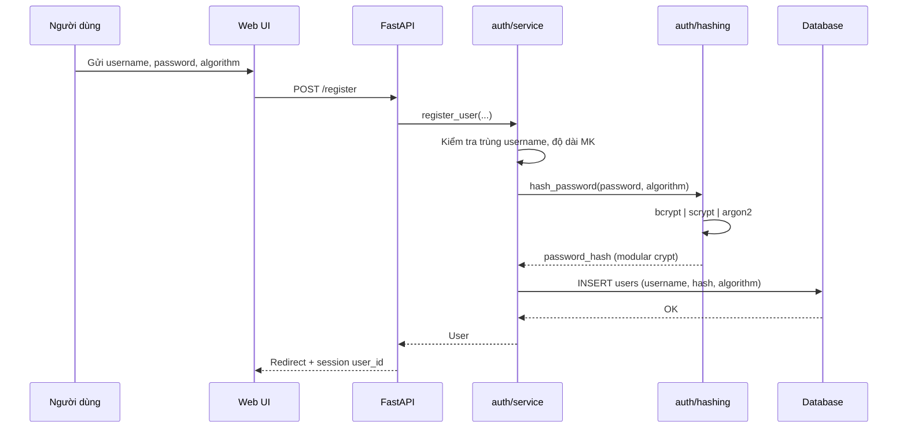
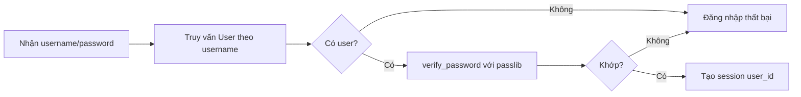

# Kiến trúc module xác thực & lưu đồ xử lý băm mật khẩu

Tài liệu mô tả thiết kế hệ thống **SecureHashAuth** (FastAPI + SQLAlchemy + Passlib).

## 1. Sơ đồ module (tầng logic)

```mermaid
flowchart TB
  subgraph presentation["Lớp giao diện"]
    UI[Web UI - Jinja2]
  end

  subgraph application["Lớp ứng dụng"]
    Routes[main.py - route HTTP]
    Svc[auth/service.py]
  end

  subgraph domain["Lớp nghiệp vụ băm"]
    Hash[auth/hashing.py]
    BC[Bcrypt]
    SC[Scrypt]
    AR[Argon2id]
  end

  subgraph data["Lớp dữ liệu"]
    DB[(SQLite users)]
    ORM[SQLAlchemy models]
  end

  UI --> Routes
  Routes --> Svc Svc --> Hash
  Hash --> BC
  Hash --> SC
  Hash --> AR
  Svc --> ORM
  ORM --> DB
```

## 2. Lưu đồ đăng ký (băm & lưu CSDL)



**Điểm an toàn:** Mật khẩu thô chỉ tồn tại trong bộ nhớ request; không ghi log; CSDL chỉ nhận `password_hash`.

## 3. Lưu đồ đăng nhập (xác minh)



`verify_password` dùng `CryptContext` với cả ba scheme; passlib tự nhận dạng thuật toán từ prefix chuỗi đã lưu.

## 4. Mô hình dữ liệu `users`

| Cột | Kiểu | Mô tả |
|-----|------|--------|
| `id` | INTEGER PK | Định danh nội bộ |
| `username` | VARCHAR(64) UNIQUE | Đăng nhập, có index |
| `password_hash` | TEXT | Chuỗi băm đầy đủ (có salt & params) |
| `algorithm` | VARCHAR(32) | `bcrypt` / `scrypt` / `argon2` — audit & hiển thị |
| `created_at` | DATETIME TZ | Thời điểm tạo (UTC) |

**Nguyên tắc:** Không cột `password` plain; không tách salt ra cột riêng bắt buộc (salt nằm trong `password_hash` theo chuẩn passlib).

## 5. Thư mục mã nguồn liên quan

```
app/
  main.py           # Route, session, mount static
  config.py         # SECRET_KEY, DATABASE_URL
  database.py       # Engine, session, init_db
  models.py         # ORM User
  auth/
    hashing.py      # Tích hợp 3 thuật toán
    service.py      # register_user, authenticate
templates/          # Giao diện
static/css/         # app.css
```

## 6. Rủi ro còn lại & mở rộng

- **Production:** Đặt `SECRET_KEY` cố định qua biến môi trường; dùng PostgreSQL; bật HTTPS; thêm rate limit đăng nhập; cân nhắc pepper trong HSM.
- **MFA / OAuth:** Có thể bổ sung sau mà không đổi format băm.
