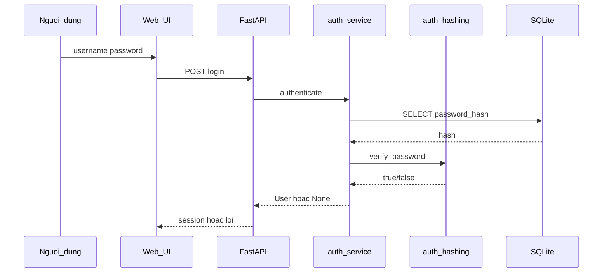

# 1.x. Nguyên lý xử lý và lưu trữ dữ liệu băm mật khẩu

*(Chèn vào Chương 1 hoặc đầu Chương Kết quả — copy vào Word và đánh số lại theo mẫu khoa.)*

## 1. Nguyên tắc chung

Hệ thống SecureHashAuth tuân thủ nguyên tắc **một chiều** khi xử lý mật khẩu: mật khẩu người dùng nhập (**plaintext**) chỉ tồn tại trong bộ nhớ của một HTTP request; **không** ghi log, **không** lưu cột `password` trong cơ sở dữ liệu. Giá trị lưu trữ là **chuỗi băm** (`password_hash`) do Passlib sinh ra theo định dạng **modular crypt**, trong đó đã nhúng **salt** và các **tham số** (cost, memory, …) của thuật toán được chọn.

Cột `algorithm` lưu thêm nhãn nghiệp vụ (`bcrypt`, `scrypt`, `argon2`) phục vụ hiển thị, thống kê thử nghiệm và audit; việc **xác minh** khi đăng nhập chủ yếu dựa vào nội dung `password_hash` (Passlib tự nhận dạng scheme từ tiền tố chuỗi).

## 2. Luồng dữ liệu khi đăng ký

Trình tự bám triển khai trong `app/main.py` → `app/auth/service.py` → `app/auth/hashing.py`:

1. **Đầu vào HTTP:** `POST /register` với `username`, `password`, `algorithm` ∈ {`bcrypt`, `scrypt`, `argon2`}.
2. **Kiểm tra nghiệp vụ:** username được strip; độ dài username ≤ 64; mật khẩu ≥ 8 ký tự; username chưa tồn tại.
3. **Băm:** `hash_password(password, algorithm)` trả về `(digest, algo_key)`:
   - **Bcrypt:** `bcrypt.using(rounds=20).hash(password)`
   - **Scrypt:** `scrypt.using(rounds=14, block_size=8, parallelism=1).hash(password)`
   - **Argon2id:** `argon2.using(time_cost=3, memory_cost=65536, parallelism=2, type="ID").hash(password)`
4. **Lưu CSDL:** `INSERT` vào bảng `users`: `password_hash = digest`, `algorithm = algo_key`.
5. **Phiên:** ghi `user_id` vào cookie session; redirect `/dashboard`.

**Bảng 1.x.1 — Biến đổi dữ liệu khi đăng ký**

| Giai đoạn | Dữ liệu | Vị trí lưu | Ghi chú |
|-----------|---------|------------|---------|
| Form gửi lên | Mật khẩu plaintext | RAM request | Không persist |
| Sau `hash_password` | Chuỗi modular crypt | `users.password_hash` | Salt + tham số trong chuỗi |
| Metadata | `bcrypt` / `scrypt` / `argon2` | `users.algorithm` | Song song với hash |
| Sau thành công | `user_id` | Cookie session | Không chứa mật khẩu |

## 3. Cấu trúc chuỗi `password_hash` (minh họa)

Với cùng mật khẩu lab và ba thuật toán khác nhau, chuỗi lưu **khác nhau hoàn toàn**; tiền tố điển hình:

| Thuật toán | Tiền tố / đặc điểm chuỗi |
|------------|---------------------------|
| Bcrypt | `$2b$` hoặc `$2a$` |
| Argon2id | `$argon2id$` |
| Scrypt | Chứa `scrypt` hoặc `$scrypt$` (theo Passlib) |

**Vì sao không tách salt ra cột riêng:** Passlib encode salt và tham số vào một chuỗi; hàm `verify_password` đọc đủ thông tin từ `password_hash`, giảm rủi ro lệch salt/tham số giữa các cột.

*Ví dụ thật: xem bảng mẫu trong `docs/bao-cao/03-du-lieu-thuc-nghiem.md` hoặc export từ DataGrip file `data/app.db`.*

## 4. Luồng dữ liệu khi đăng nhập

1. **Đầu vào:** `POST /login` — `username`, `password` (plaintext).
2. **Truy vấn:** `SELECT` user theo `username` → lấy `password_hash`.
3. **Xác minh:** `verify_password(password, password_hash)` — `CryptContext` với schemes `argon2`, `bcrypt`, `scrypt`.
4. **Kết quả:**
   - Khớp → session `user_id`, redirect `/dashboard`.
   - Không khớp hoặc không có user → thông báo chung *"Sai tên đăng nhập hoặc mật khẩu"* (giảm user enumeration).

*Hình tương đương (flowchart): `docs/drawio/ch3-3.5.2-luong-dang-nhap.drawio`.*

## 5. Kết luận ngắn (mục này)

Dữ liệu nhạy cảm được thu hẹp thành **một chiều băm có tham số** và **phiên không mang mật khẩu**; đây là cơ sở để các chương sau trình bày triển khai, đo hiệu năng và thử nghiệm ngoại tuyến trên **chuỗi hash** thay vì plaintext.
