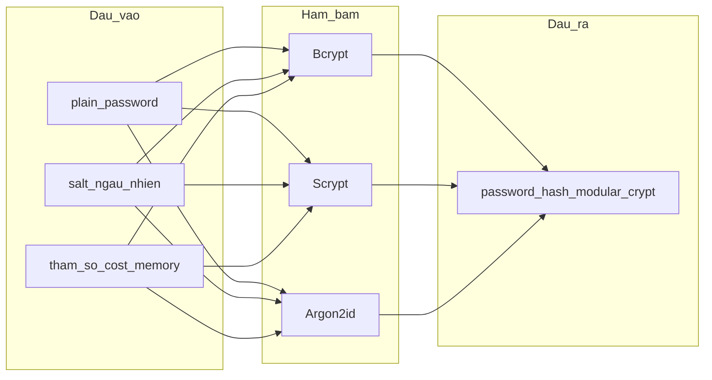

# 1.x. Nguyên lý hoạt động dữ liệu băm mật khẩu (Bcrypt, Scrypt, Argon2id)

*(Chèn vào Chương 1 — copy vào Word và đánh số lại theo mẫu khoa. Luồng đăng ký/đăng nhập xem chương thiết kế hoặc `docs/drawio/`.)*

## 1. Khái niệm dữ liệu đầu vào — đầu ra

Với mỗi thuật toán băm mật khẩu trong đề tài, **dữ liệu đầu vào** gồm:

- **Mật khẩu** (chuỗi ký tự do người dùng chọn, trong code là `plain_password`).
- **Salt** (giá trị ngẫu nhiên do thuật toán/thư viện sinh khi băm; không do người dùng nhập).
- **Tham số độ khó** (cost, bộ nhớ, số vòng lặp, …) — cố định theo cấu hình hệ thống khi băm.

**Dữ liệu đầu ra** là **một chuỗi ký tự** (`password_hash`) theo định dạng **modular crypt** (Passlib): chứa **đủ thông tin** để sau này tái tạo salt, đọc tham số và **xác minh** mật khẩu mới mà không cần lưu salt ở cột riêng.

**Nguyên tắc một chiều:** Từ `password_hash` **không** suy ngược được mật khẩu gốc; chỉ có thể **thử** (guess) và chạy lại hàm băm với từng phỏng đoán — đó là cơ sở chống tấn công ngoại tuyến.

---

## 2. Bcrypt — nguyên lý và dữ liệu

### 2.1. Nguyên lý

Bcrypt xây dựng trên mật mã **Blowfish**, thiết kế để **làm chậm** tính toán bằng cách lặp nội bộ với độ khó tăng theo **work factor** (`rounds`). Thuật toán thiên về **tốn CPU** (CPU-bound): mỗi lần băm hoặc verify tốn thời gian xử lý trên bộ xử lý, không yêu cầu vùng RAM lớn cố định như Scrypt/Argon2.

### 2.2. Dữ liệu tham gia

| Thành phần | Nguồn | Vai trò |
|------------|--------|---------|
| Mật khẩu | Người dùng | Bí mật cần bảo vệ |
| Salt | Sinh ngẫu nhiên khi `hash()` | Khác nhau giữa các lần băm → hash khác nhau dù cùng MK |
| `rounds` | Cấu hình (`rounds=20` trong project) | Tăng rounds → thời gian băm/verify tăng mạnh (gần theo cấp số nhân 2) |

### 2.3. Dữ liệu đầu ra (chuỗi lưu)

- Tiền tố điển hình: **`$2b$`** hoặc **`$2a$`**.
- Trong chuỗi có mã hóa **cost** (ví dụ `$2b$20$` tương ứng work factor 20) và **salt** + phần hash.
- **Cùng mật khẩu, hai lần băm** → hai chuỗi **khác nhau** vì salt khác.

**Triển khai project:** `bcrypt.using(rounds=20).hash(plain_password)`.

---

## 3. Scrypt — nguyên lý và dữ liệu

### 3.1. Nguyên lý

Scrypt (Percival) là hàm **memory-hard**: ngoài chi phí CPU còn yêu cầu một vùng **RAM** có kích thước phụ thuộc tham số, với kiểu truy cập bộ nhớ khiến song song hóa hàng loạt trên GPU (mỗi luồng cần bản sao bộ nhớ) trở nên **đắt** hơn so với chỉ tăng số lõi tính toán.

### 3.2. Dữ liệu tham gia

| Thành phần | Trong Passlib (project) | Ý nghĩa |
|------------|-------------------------|---------|
| Mật khẩu | `plain_password` | Đầu vào bí mật |
| Salt | Tự sinh | Phân tán hash giữa các tài khoản |
| `rounds` | `14` | Liên quan độ khó / kích thước bộ nhớ (theo mô hình Scrypt) |
| `block_size` | `8` | Kích thước khối (tham số `r`) |
| `parallelism` | `1` | Mức song song hóa (`p`) |

### 3.3. Dữ liệu đầu ra (chuỗi lưu)

- Passlib thường cho chuỗi dạng **`$scrypt$...`** (có thể chứa các trường `ln`, `r`, `p` và salt/hash mã hóa).
- Chuỗi **tự mô tả** tham số đã dùng khi băm → verify dùng đúng cấu hình đó.

**Triển khai project:** `scrypt.using(rounds=14, block_size=8, parallelism=1).hash(plain_password)`.

---

## 4. Argon2id — nguyên lý và dữ liệu

### 4.1. Nguyên lý

Argon2 (RFC 9106) là họ hàm memory-hard hiện đại, chiến thắng Password Hashing Competition. **Argon2id** kết hợp đặc điểm Argon2i và Argon2d: phù hợp **lưu mật khẩu**, cân bằng khả năng chống một số dạng tấn công bộ nhớ và kênh phụ so với biến thể thuần Argon2d.

Điều chỉnh độ khó qua **thời gian** (`time_cost`), **bộ nhớ** (`memory_cost`, thường tính theo KiB trong thư viện), và **song song** (`parallelism`).

### 4.2. Dữ liệu tham gia

| Thành phần | Trong Passlib (project) | Ý nghĩa |
|------------|-------------------------|---------|
| Mật khẩu | `plain_password` | Đầu vào bí mật |
| Salt | Tự sinh | Khác biệt hóa đầu ra |
| `time_cost` | `3` | Số lần lặp qua bộ nhớ |
| `memory_cost` | `65536` | Yêu cầu RAM (theo đơn vị Passlib/argon2-cffi) |
| `parallelism` | `2` | Số lane song song |
| `type` | `"ID"` | Chọn biến thể **Argon2id** |

### 4.3. Dữ liệu đầu ra (chuỗi lưu)

- Tiền tố: **`$argon2id$`** kèm phiên bản và các trường `m`, `t`, `p` (ví dụ `$argon2id$v=19$m=65536,t=3,p=2$...`).
- Salt và hash nằm trong phần sau của chuỗi.

**Triển khai project:** `argon2.using(time_cost=3, memory_cost=65536, parallelism=2, type="ID").hash(plain_password)`.

---

## 5. So sánh dữ liệu giữa ba thuật toán

**Bảng 1.x.1 — Đặc trưng dữ liệu và tham số (trong SecureHashAuth)**

| Tiêu chí | Bcrypt | Scrypt | Argon2id |
|----------|--------|--------|----------|
| Trọng tâm chi phí | CPU (`rounds`) | CPU + RAM (`rounds`, `block_size`, `parallelism`) | Thời gian + RAM + song song (`time_cost`, `memory_cost`, `parallelism`) |
| Salt | Trong chuỗi hash | Trong chuỗi hash | Trong chuỗi hash |
| Tiền tố chuỗi lưu | `$2b$` / `$2a$` | `$scrypt$` | `$argon2id$` |
| Tham số project | `rounds=20` | `rounds=14`, `block_size=8`, `p=1` | `t=3`, `m=65536`, `p=2`, type ID |
| Cùng MK, hai lần băm | Hai chuỗi khác (salt khác) | Hai chuỗi khác | Hai chuỗi khác |

**Bảng 1.x.2 — Ví dụ tiền tố chuỗi thực tế (mật khẩu lab `Secret123!`)**

| Thuật toán | Rút gọn `password_hash` (minh họa) |
|------------|-------------------------------------|
| Bcrypt | `$2b$20$Bdzy2hmxWFwGb4KCbWUpaO2b1mWihzlPy1oFzsa9r…` |
| Scrypt | `$scrypt$ln=14,r=8,p=1$yLmXkpISAkBIKQVAqPWeMw$Ttj…` |
| Argon2id | `$argon2id$v=19$m=65536,t=3,p=2$YMz5vzdmLOU8h1Aqx…` |

*Nguồn đầy đủ: `results/users_sample.md` (user_bcrypt / user_scrypt / user_argon2).*

---

## 6. Xác minh dữ liệu (verify) — góc nhìn thuật toán

Khi có `plain_password` mới và chuỗi `stored_hash` đã lưu:

1. Passlib **phân tích** chuỗi hash → nhận scheme (bcrypt / scrypt / argon2) và **đọc salt + tham số** đã nhúng.
2. Chạy lại quá trình băm với **cùng tham số** và salt từ chuỗi, so sánh với phần hash trong chuỗi.
3. Trả về **khớp / không khớp** — không xuất lại mật khẩu gốc.

Project dùng một `CryptContext` chung cho cả ba scheme (`verify_password` trong `app/auth/hashing.py`). Đây là **cơ chế dữ liệu** của verify, không phụ thuộc luồng HTTP cụ thể.

---

## 7. Liên hệ ngắn với lưu trữ CSDL (không mở rộng luồng nghiệp vụ)

Sau khi một trong ba hàm trên sinh `digest`, hệ thống chỉ persist:

- `users.password_hash` = chuỗi modular crypt;
- `users.algorithm` = nhãn `bcrypt` | `scrypt` | `argon2` (hỗ trợ báo cáo và thống kê).

**Không** lưu plaintext. Chi tiết luồng đăng ký/đăng nhập, phiên, API: xem chương **Phân tích và thiết kế** và sơ đồ `docs/drawio/ch3-3.5.1-luong-dang-ky.drawio`, `ch3-3.5.2-luong-dang-nhap.drawio`.

---

## 8. Kết luận mục

Nguyên lý **dữ liệu băm** của đề tài xoay quanh việc mỗi thuật toán biến đổi `(mật khẩu, salt, tham số)` thành **một chuỗi hash tự mô tả**, với **Bcrypt** nhấn mạnh cost CPU, **Scrypt** và **Argon2id** bổ sung chiều **bộ nhớ** và tham số hiện đại. So sánh thực nghiệm (thời gian băm, độ khó tấn công ngoại tuyến) dựa trên **cùng định dạng dữ liệu đầu ra** này — xem `docs/bao-cao/03-du-lieu-thuc-nghiem.md`.
