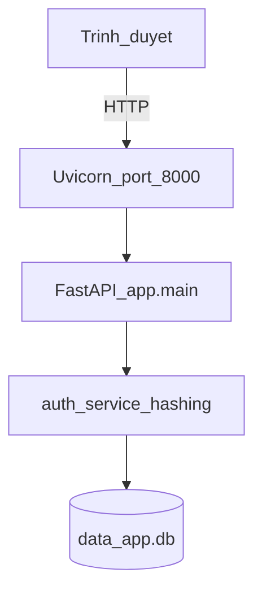

# Môi trường triển khai ứng dụng web

*(Chèn vào Chương Kết quả — trước mục thử nghiệm.)*

## 1. Tổng quan

Ứng dụng **SecureHashAuth** chạy trên **máy lab / máy phát triển** của nhóm, không yêu cầu deploy cloud cho phạm vi khóa luận. Kiến trúc triển khai là **một tiến trình ASGI** phục vụ HTTP, kết nối trực tiếp tới **file SQLite** trên đĩa cục bộ.

## 2. Bảng thành phần triển khai

| Thành phần | Công nghệ | Chi tiết |
|------------|-----------|----------|
| HTTP server | **Uvicorn** (ASGI) | `uvicorn app.main:app --reload --host 0.0.0.0 --port 8000` |
| Framework | **FastAPI** | Entry: `app/main.py` |
| Giao diện | **Jinja2** | Thư mục `templates/`, static `static/css/` |
| Truy cập client | Trình duyệt | `http://127.0.0.1:8000` (local) hoặc `http://<IP-máy-lab>:8000` (LAN, khi bind `0.0.0.0`) |
| CSDL | **SQLite** | `DATABASE_URL` mặc định: `sqlite:///./data/app.db` → file `data/app.db` |
| ORM | **SQLAlchemy 2** | `app/database.py`, model `User` |
| Phiên | **SessionMiddleware** (Starlette) | Cookie ký bằng `SECRET_KEY`; `max_age` 7 ngày |
| Băm mật khẩu | **Passlib** + backends | `app/auth/hashing.py` |

## 3. Sơ đồ triển khai vật lý / logic



**Chú thích:** DataGrip (hoặc DB Browser for SQLite) chỉ **đọc/ghi file** `data/app.db` để quan sát dữ liệu thử nghiệm — **không** phải nơi ứng dụng web “chạy”.

## 4. Cài đặt và khởi chạy

```bash
cd SecureHashAuth
python3 -m venv .venv
.venv/bin/pip install -r requirements.txt
export SECRET_KEY="chuoi-bi-mat-co-dinh-cho-demo"   # khuyến nghị khi báo cáo
.venv/bin/uvicorn app.main:app --reload --host 0.0.0.0 --port 8000
```

- **Khởi tạo bảng:** `init_db()` trong lifespan FastAPI — tạo `users` nếu chưa có.
- **Kiểm tra sống:** `GET http://127.0.0.1:8000/health` → `{"status":"ok"}`.

## 5. Bảng môi trường phần cứng — phần mềm (điền khi nộp)

| Hạng mục | Giá trị (nhóm điền) |
|----------|---------------------|
| Hệ điều hành | |
| CPU | |
| RAM | |
| Python | `python3 --version` |
| Ngày đo / chạy demo | |

*Ảnh minh chứng đề xuất: (1) terminal chạy uvicorn, (2) trình duyệt trang chủ `http://127.0.0.1:8000`.*

## 6. Lab so với production

| Khía cạnh | Môi trường lab (đề tài) | Production (định hướng) |
|-----------|-------------------------|-------------------------|
| Transport | HTTP nội bộ | HTTPS bắt buộc |
| CSDL | SQLite file | PostgreSQL / managed DB |
| Secret phiên | Có thể sinh ngẫu nhiên mỗi restart | `SECRET_KEY` cố định, quản lý secret |
| Bảo vệ đăng nhập | Chưa rate limit | Rate limit, MFA, giám sát |
| Hiển thị hash | Dashboard có thể hiện full hash (demo) | Không hiển thị cho end-user |

Tham chiếu thêm: `docs/ARCHITECTURE.md` (rủi ro còn lại).
